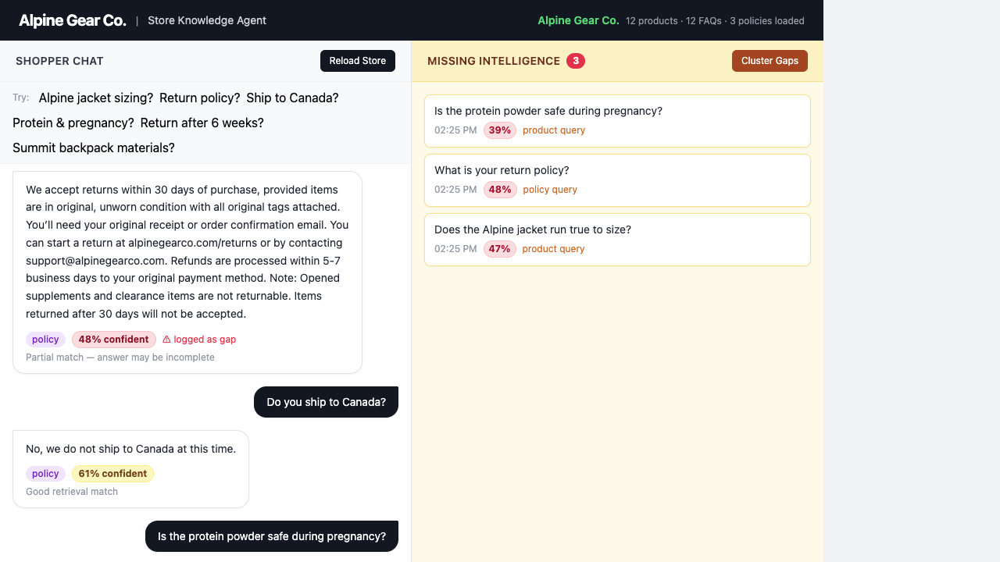

# Store Knowledge Agent

Most store chatbots answer questions. This one also tracks the ones it *couldn't* answer — and tells the merchant what to fix.



**Left panel** — a shopper asks questions, gets answers with a confidence score on every response.  
**Right panel** — every low-confidence answer is logged instantly. Hit "Cluster Gaps" and the system groups them into themes with content recommendations.

The sample store is a fictional outdoor gear brand. It has products, policies, and FAQs — but also a few deliberate blind spots. Those are what surface on the right.

---

## What the examples show

| Question | Confidence | What happens |
|----------|-----------|--------------|
| "What's your return policy?" | 48% | Policy retrieved, answer generated — but similarity is borderline, flagged as a gap |
| "Do you ship to Canada?" | 61% ✓ | Policy explicitly says no Canada — clean direct answer |
| "Is the protein powder safe during pregnancy?" | 39% ⚠ | No relevant content exists anywhere in the store — logged as a gap immediately |
| "Can I return a jacket bought 6 weeks ago?" | ~45% ⚠ | Policy covers 30 days, agent hedges on the edge case — flagged |

After a few questions, click **Cluster Gaps** → the three flagged questions group into themes ("Supplement Safety", "Return Edge Cases") with a one-line recommendation each.

That's the point: every unanswered question becomes a structured merchant insight, not just a silent bounce.

---

## Run it

Needs a free [OpenRouter](https://openrouter.ai/keys) API key (no credit card).

```bash
git clone https://github.com/Sumanth0601/store-knowledge-agent
cd store-knowledge-agent
pip install -r requirements.txt
cp .env.example .env  # add your key
uvicorn main:app --reload
```

Open `http://localhost:8000`, click **Load Store**, start asking.


- **Canada shipping** — policy explicitly states no Canada shipping but no FAQ entry exists
- **Supplement safety during pregnancy** — no medical guidance exists in the knowledge base
- **Returns past 30 days** — policy says 30-day window; a question about 6 weeks will hedge
- **Waterproof ratings** — no product mentions a waterproof rating (mm H₂O); such questions get low retrieval scores
